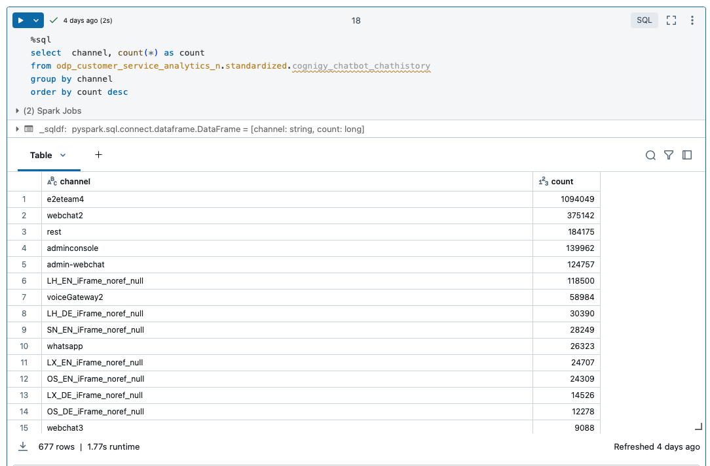
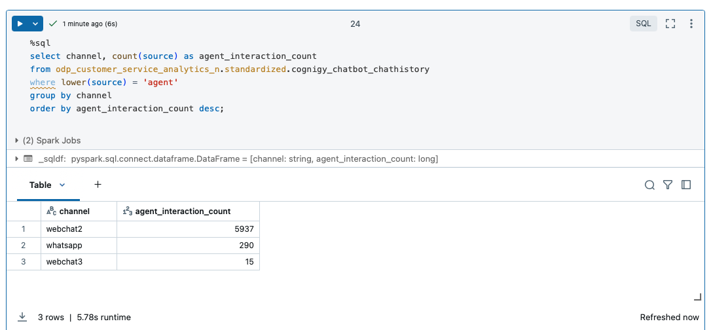
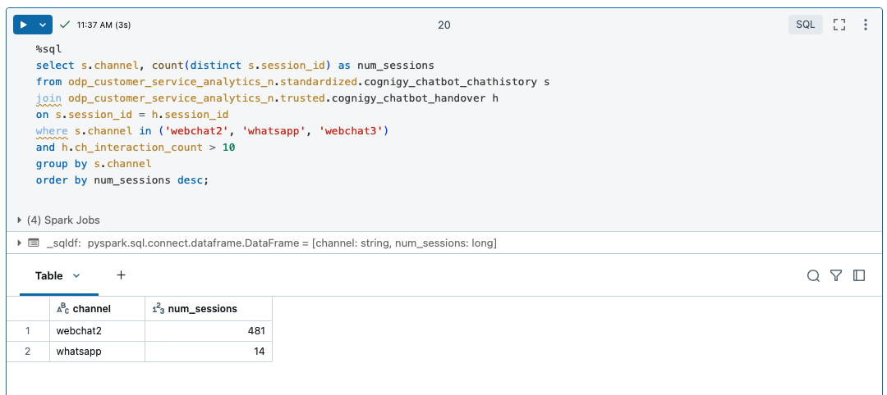
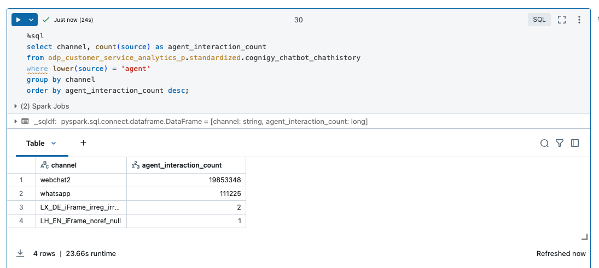
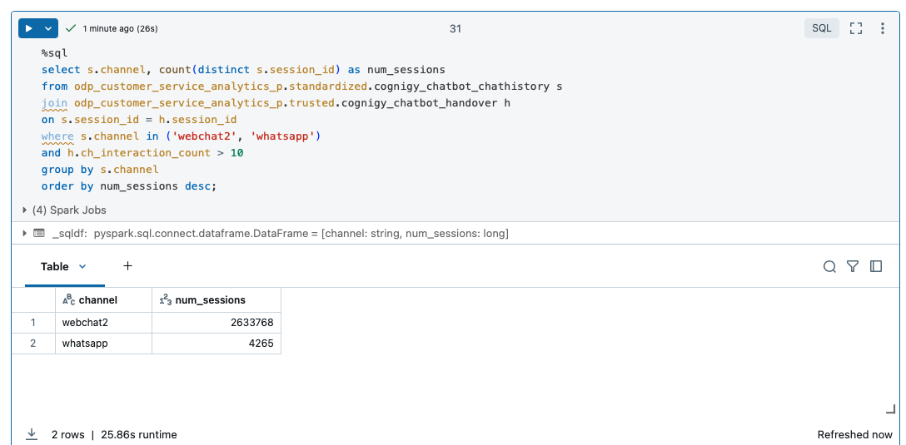

# **Verification Across Multiple Storage Accounts**

As part of the data availability check process, we will be reviewing two **Azure Storage Accounts** to ensure that the required data is accessible. Specifically, we will verify the presence of the data across two containers located in the following **Azure Storage Accounts**:

- **Azure Storage Account:** `odpweursensadls004n`
- **Azure Storage Account:** `odpweursensadls004p`

We will also verify the relevant data in this second storage account, ensuring **consistency and accessibility** for all datasets across the two accounts. 

This **dual-check approach** across both storage accounts will help confirm the **availability and integrity** of the required datasets for further processing.
 

## Azure Storage account odpweursensadls004n | Containers: 

#### **1. Logs and Application Data**
- **`$logs`** – Stores system logs, including access logs, query logs, and error reports.
- **`application-logs`** – Contains logs related to application runtime, including service execution details and failures.

#### **2. Data Processing Stages**
- **`raw`** – The initial ingestion layer containing unprocessed or minimally processed data.
- **`curated`** – A cleaned, processed, and structured version of raw data, typically used for reporting and analytics.
- **`standardized`** – A structured and formatted version of curated data, following predefined schemas.
- **`trusted`** – A validated dataset that is certified for production use, ensuring high data quality and integrity.

#### **3. Workflow and Temporary Storage**
- **`temp`** – Temporary storage for intermediate data used in processing jobs.
- **`sandbox`** – A temporary or development environment for testing and experimentation.
- **`artifacts`** – Stores compiled models, scripts, or pipeline artifacts used for machine learning and data processing.

#### **4. Data Export and Sharing**
- **`export`** – A location where processed data is exported for external usage, sharing, or visualization.

#### **5. Specialized Storage**
- **`topics`** – Likely used for event-driven architectures, storing messages or events related to a pub/sub model.
- **`unity-catalog-managed`** – Managed storage for **Unity Catalog**, a governance framework for **Databricks**, controlling access and organization.

These containers represent different stages or categories of data within the storage account, from **raw, unprocessed data** to **cleaned and validated datasets**. 

- **Curated, Trusted, and Standardized**: Likely store data ready for **analysis and reporting**.
- **Sandbox, Temp, and Export**: Serve as **temporary or intermediate storage** for processing activities.

### **Checking Data Availability**

To check the availability of data in the specified locations, you can follow these steps using **Azure Storage Explorer** or **Azure Portal**, depending on the tool you're using.

#### **1. Check Availability in the Trusted Container**
- **Path:** `trusted / lhg / customer / chatbot_handover_reports / chatbot_handover`

#### **2. Check Availability in the Standardized Container**
- **Path:** `standardized / lhg / customer / cognigy_v4 / chatbot_chathistory`

### **Steps to Check in Azure Portal or Azure Storage Explorer**

#### **Azure Portal:**
1. Open the **Azure Portal**.
2. Navigate to your **Storage Account** (`odpweursensadls004n`).
3. Under **Containers**, locate the **trusted** container and navigate to:
   - `lhg/customer/chatbot_handover_reports/chatbot_handover`
4. Similarly, locate the **standardized** container and navigate to:
   - `lhg/customer/cognigy_v4/chatbot_chathistory`

#### **Azure Storage Explorer:**
1. Open **Azure Storage Explorer**.
2. Connect to your **Azure Storage Account** (`odpweursensadls004n`).
3. Browse to the **trusted** container and check the path:
   - `lhg/customer/chatbot_handover_reports/chatbot_handover`
4. Also, check the **standardized** container for the path:
   - `lhg/customer/cognigy_v4/chatbot_chathistory`

## SQL Query Analysis of Chatbot Interaction History

### Overview
This section details an SQL query executed in a Spark job environment to analyze chatbot interaction history. The query retrieves and summarizes interaction counts grouped by communication channel.

### SQL Query Explanation
- The query extracts data from the `cognigy_chatbot_chathistory` table within the `odp_customer_service_analytics_n.standardized` database.
- It counts the number of interactions per **channel** (e.g., web chat, voice gateway) and orders the results in descending order based on interaction count.

### Columns in the Query Result
- **Channel**: Represents the communication platform used for chatbot interactions (e.g., `e2team4`, `webchat2`, `rest`).
- **Count**: Shows the number of chatbot interactions per channel.

### Insights from Query Results
- The results help identify which channels are most frequently used for chatbot interactions.
- The table is sorted by interaction count, showing `e2team4` as the most used channel with **1,094,049** interactions and `webchat3` as the least used with **9,088** interactions.
- These insights can help evaluate the effectiveness and popularity of different communication channels for customer engagement.

## SQL Query Analysis of Agent Interactions

### Overview
This section describes an SQL query that retrieves the count of **agent interactions** by communication channel from the `cognigy_chatbot_chathistory` table. The query filters the data to include only interactions where the **source** is labeled as `'agent'`. The results are grouped by **channel** and ordered by **agent interaction count** in descending order.

### Key Insights from the Query Results
- **Channel**: Displays the names of channels where agent interactions took place (e.g., `webchat2`, `whatsapp`, `webchat3`).
- **Agent Interaction Count**: Shows the total number of interactions that involved an agent for each channel.
  - `webchat2` has the highest number of agent interactions with **5,937** interactions.
  - `whatsapp` follows with **290** agent interactions.
  - `webchat3` has significantly fewer agent interactions, with only **15** interactions.

### Interpretation
This dataset provides insights into which channels are most frequently used for **agent interactions**. 
- `webchat2` stands out as the primary channel for agent involvement.
- Other channels, such as `whatsapp` and `webchat3`, have **relatively fewer** interactions requiring human intervention.
- Understanding these trends can be valuable in **evaluating channel effectiveness** and determining where human support is most needed in chatbot interactions.

### Analysis of High Interaction Count Sessions

Based on the results of the query, we analyzed the distribution of sessions with high interaction counts (greater than 10) across the specified channels: `webchat2`, `whatsapp`, and `webchat3`.

#### Interpretation of the Results:
- **webchat2** stands out as the channel with the most sessions that have high interaction counts, totaling **481 unique sessions**. This indicates that `webchat2` is the most active channel in terms of user interactions that involve agents, with a significant number of sessions having a higher-than-usual interaction count.

- **whatsapp**, on the other hand, has **14 unique sessions** that meet the high interaction threshold. This suggests that while `whatsapp` is a used channel, it doesn't have as many sessions with high interaction counts compared to `webchat2`.

- **webchat3** was not included in the results, meaning that it didn't meet the condition of having a `ch_interaction_count` greater than 10, or it may not have had any sessions that qualified for the high interaction count filter.

#### Summary:
This analysis highlights that `webchat2` is the dominant channel with the most sessions involving higher interaction counts, while `whatsapp` sees significantly fewer such sessions. This insight is useful for focusing resources on the most engaging channels and understanding user behavior better across these platforms.

## Azure Storage account odpweursensadls004p

### **Channel Interaction Volume in the Chatbot Dataset**

This section provides insights into the **distribution of interaction volume** across different channels in the `cognigy_chatbot_chathistory` table from the **Standardized** container.

#### **Key Findings:**
- **Top Channel:** `webchat2` has the highest count of **181,479,236** records, making it the most active channel.
- Other significant channels, such as **LH_EN_iframe_irreg_irreg** and **LH_DE_iframe_irreg_irreg**, also have considerable interaction volumes, reflecting their system usage.
- This data offers valuable insights into **relative engagement across channels**, with `webchat2` clearly dominating chatbot interactions.

### **Agent Interaction Counts Across Channels**

This section provides an overview of **agent interactions** across different channels in the `cognigy_chatbot_chathistory` table from the **Standardized** container.

#### **Key Findings:**
- **Top Channel:** `webchat2` has the highest number of agent interactions, with **1,985,348** interactions.
- **whatsapp** follows with **111,225** agent interactions.
- Other channels, such as **LX_DE_iframe_irreg_irreg** and **LH_EN_iframe_noref_null**, show significantly fewer interactions, with **2** and **1** respectively.
- This data highlights the most active channels where agents are engaged, with `webchat2` leading in terms of interaction volume.

### **Session Count with High Interaction Across Channels**

This section analyzes the number of unique sessions with more than **10 interactions** for key channels in the chatbot dataset.

#### **Key Findings:**
- **webchat2** has **2,633,768** sessions with more than 10 interactions, indicating a significantly higher volume of sessions compared to other channels.
  

  
- **whatsapp** has **4,265** sessions with more than 10 interactions, much lower than `webchat2`.
- This data highlights the difference in session activity between the two channels, with `webchat2` clearly having a much higher volume of sessions with substantial agent interactions.

